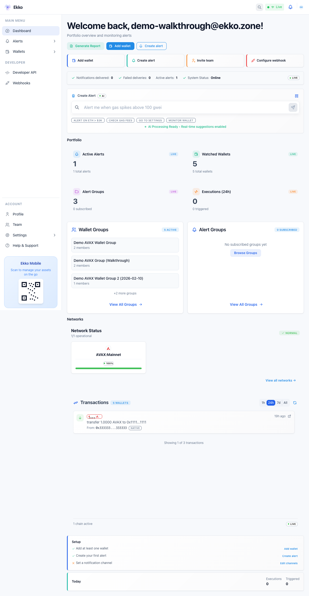
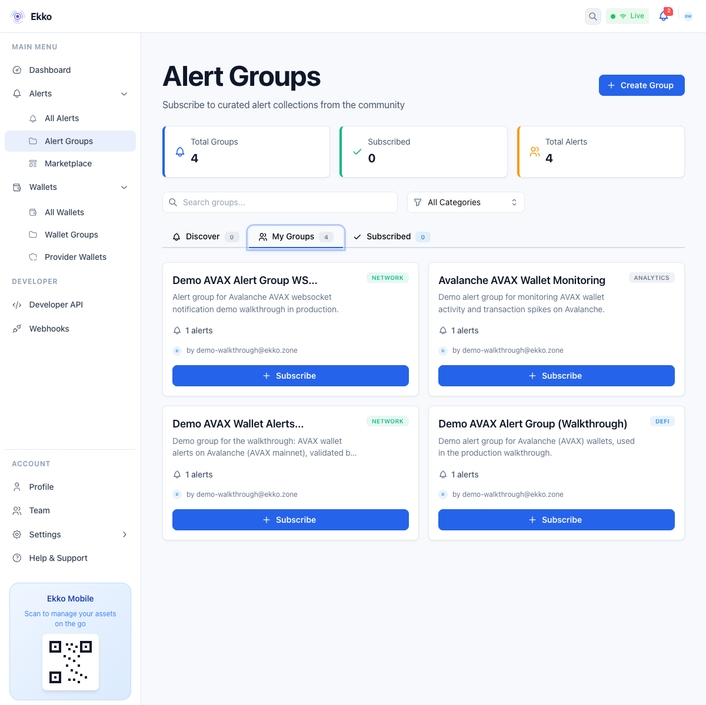
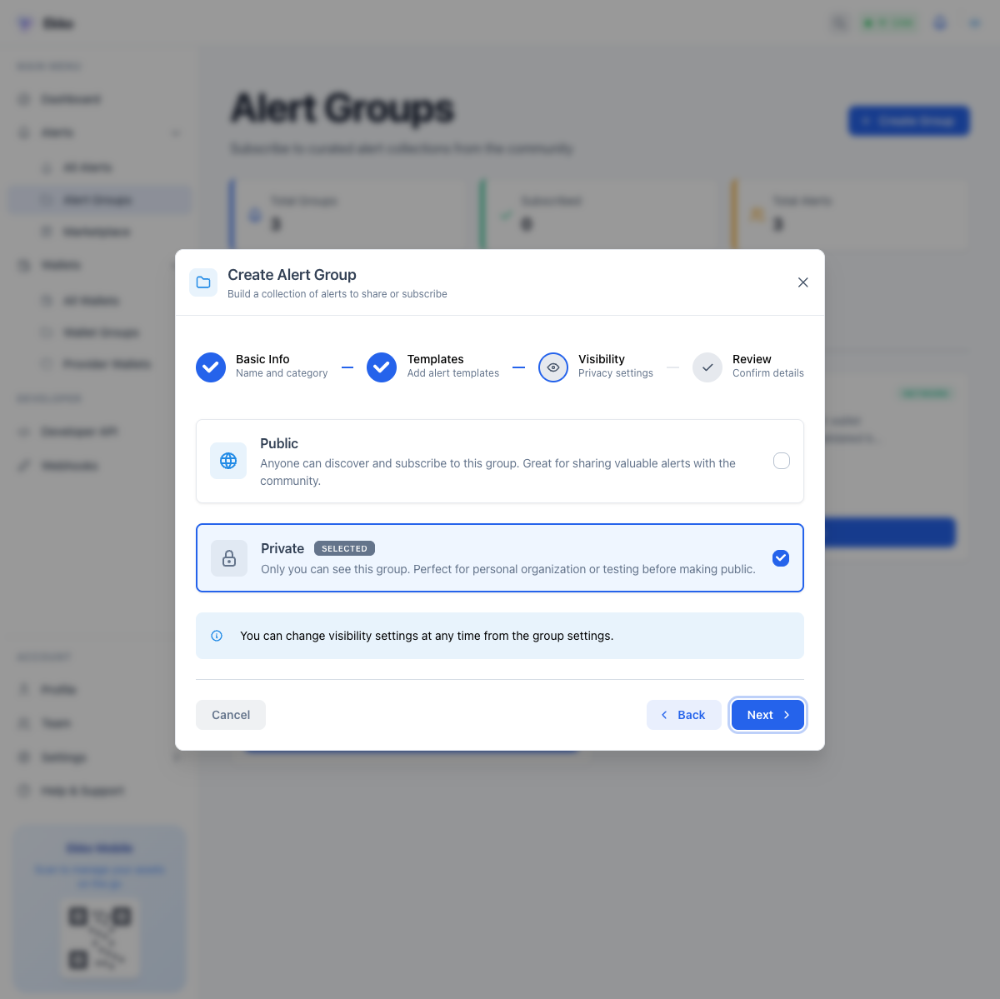
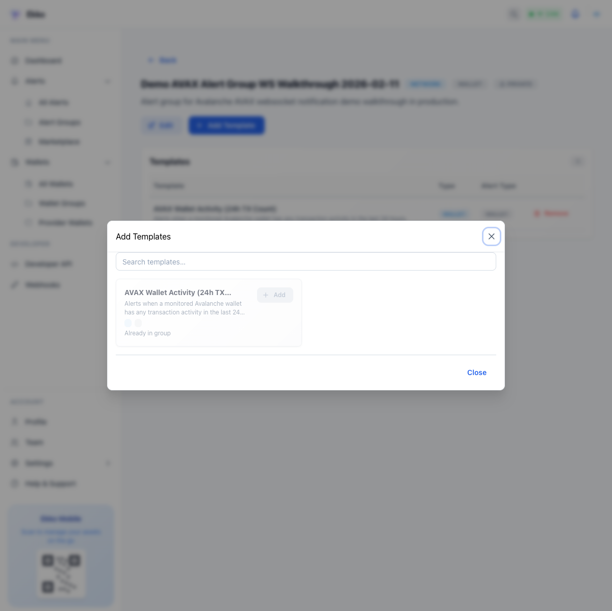
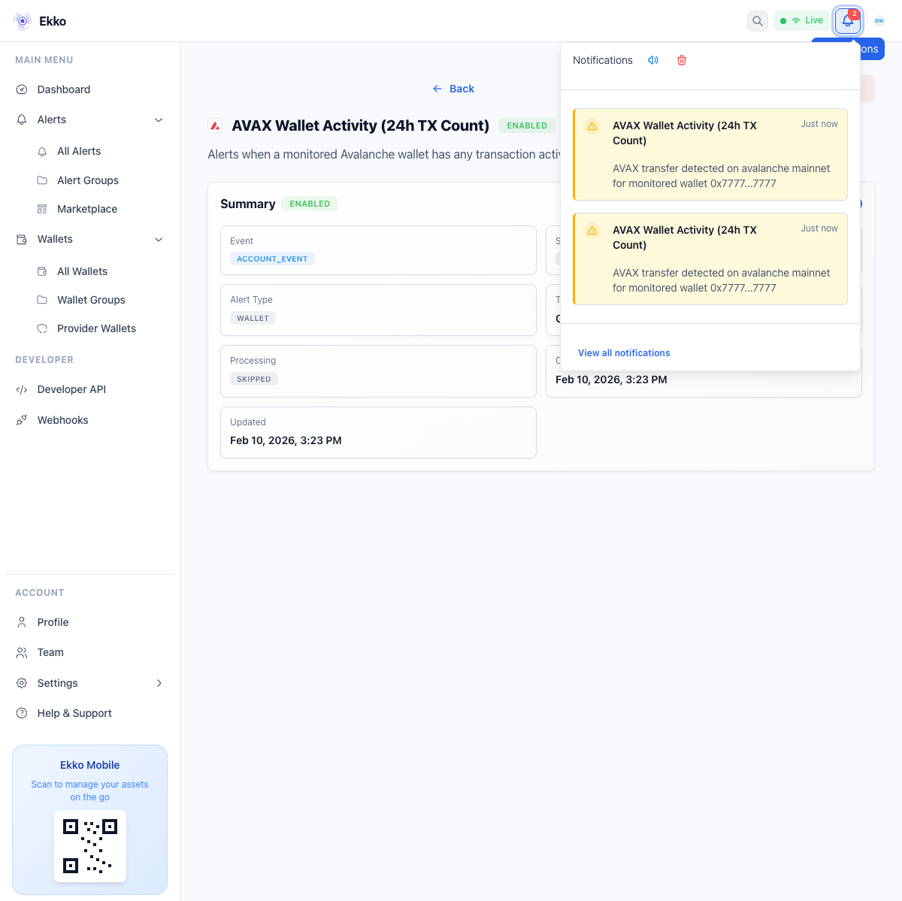

# Ekko CE


Open-source, real-time blockchain monitoring and alerting built for Avalanche teams.

Create alerts in natural language, evaluate them in a low-latency event pipeline, and deliver notifications fast across multiple channels.

[Run locally](#quick-start) | [View screenshots](#screenshots) | [Use full hosted version](https://app.ekko.zone)

## GitHub Launch Copy

Design spec for social image: [`screens/GITHUB-SOCIAL-PREVIEW-SPEC.md`](./screens/GITHUB-SOCIAL-PREVIEW-SPEC.md)

**Suggested repo description (<=160 chars):**
Avalanche-first open-source monitoring and alerting platform with natural-language alerts, fast NATS+wasmCloud runtime, and multi-channel notifications.

**Suggested social preview text:**
Ekko CE helps teams monitor Avalanche activity in real time. Build alerts in plain English, route notifications instantly, and self-host the full stack in minutes.

## Why Teams Choose Ekko CE

- **Natural-language alerts**: define monitoring logic in plain English.
- **Fast by design**: NATS + wasmCloud event-driven runtime for low-latency alert handling.
- **Multi-channel notifications**: in-app, email, webhooks now, with architecture ready for more channels.
- **Avalanche-first workflows**: designed for Avalanche networks and subnet-oriented operations.
- **Open-source control**: run locally, inspect everything, and extend to your stack.

## Get Value in 60 Seconds

1. Copy env defaults:

```bash
cp .env.example .env
```

2. Start the full stack:

```bash
docker compose up --build
```

3. Open the app and create your first alert:

- Dashboard: `http://localhost:3000`
- Example prompt: `Alert me when wallet 0x... has AVAX transfer activity above my threshold`

After the first build/pull, restarts are typically up in seconds.

## Built for Avalanche Ecosystem Teams

Ekko CE is optimized for Avalanche operational use cases:

- monitor AVAX wallet and contract activity,
- organize templates into reusable alert groups,
- route critical signals to team channels,
- extend chain/subnet configuration as your deployment evolves.

## Personas and How They Use Ekko

- **Protocol Developers**: track contract interactions and protocol-critical events.
- **Wallet Providers**: manage wallet groups and run high-volume monitoring flows.
- **Crypto Investors**: set portfolio alerts quickly with natural-language setup.
- **Team Leads**: coordinate shared monitoring and incident visibility.
- **Developers**: integrate with API/webhooks and automate downstream workflows.
- **Blockchain Analysts**: monitor transaction patterns and live operational signals.

## Product Flow

1. **Parse intent** from natural language (`/api/alerts/parse/`).
2. **Save reusable template** (`/api/alert-templates/`).
3. **Create alert instance** with targets and schedule (`/api/alert-instances/` or `/api/alerts/`).
4. **Evaluate in runtime** via wasmCloud actors/providers over NATS subjects.
5. **Notify immediately** through configured channels.

## CE vs Hosted

| Capability | Ekko CE (Open Source) | Full Hosted Version (`app.ekko.zone`) |
|---|---|---|
| Setup model | Self-hosted via Docker Compose | Fully managed SaaS |
| Natural-language alert creation | Yes | Yes |
| Multi-channel notifications | Yes (extensible) | Yes (managed) |
| Infrastructure operations | You run and maintain | Ekko-managed |
| Knowledge-backed product layer | Community/self-curated | Included |
| Best fit | Teams needing OSS control and customization | Teams wanting fastest production onboarding |

For the full, knowledge-backed managed experience, sign up at **https://app.ekko.zone**.

## Architecture

- `dashboard/`: React + Vite web app.
- `api/`: Django REST API for auth, templates, instances, teams, and notifications.
- `wasmcloud/`: actors/providers for ingestion, evaluation, and routing.
- Infra via Compose: PostgreSQL, Redis, NATS JetStream, MinIO, local OCI registry.

## Quick Start

### 1) Configure env

```bash
cp .env.example .env
```

### 2) Start everything

```bash
docker compose up --build
```

### 3) Open apps

- Dashboard: `http://localhost:3000`
- API root: `http://localhost:8000/`
- API health: `http://localhost:8000/health/`
- Django admin: `http://localhost:8000/admin/`
- NATS monitoring: `http://localhost:8222`
- MinIO console: `http://localhost:9001`

### 4) Optional admin user

```bash
docker compose exec api python manage.py createsuperuser
```

### 5) Stop or reset

```bash
# stop
docker compose down

# full reset (includes volumes)
docker compose down -v
```

## Copy/Paste Demo Prompts

Use these in the alert creation flow to get to value quickly:

- `Alert me when wallet 0x... receives any AVAX transfer on Avalanche C-Chain.`
- `Notify me if wallet 0x... sends more than 25 AVAX in a single transaction.`
- `Alert when wallet group Treasury has more than 5 outgoing AVAX transfers in 10 minutes.`
- `Notify me when contract 0x... emits transfer events above 10000 USDC equivalent.`
- `Alert me if no inbound transactions are seen for wallet 0x... in the last 24 hours.`
- `Send webhook notification when AVAX balance for wallet 0x... drops below 50.`

## Screenshots

### 1) Dashboard Home



### 2) Alert Groups Overview



### 3) Create Group: Visibility



### 4) Alert Group Detail: Add Template



### 5) Alert Detail (Live)


### 6) Alert Detail with Notifications



## Project Layout

```text
.
├── api/
├── dashboard/
├── wasmcloud/
├── screens/
├── scripts/
├── docker-compose.yml
└── .env.example
```

## Useful Commands

```bash
# running services
docker compose ps

# logs
docker compose logs -f api
docker compose logs -f dashboard
docker compose logs -f wasmcloud

# migrations
docker compose exec api python manage.py migrate
```
