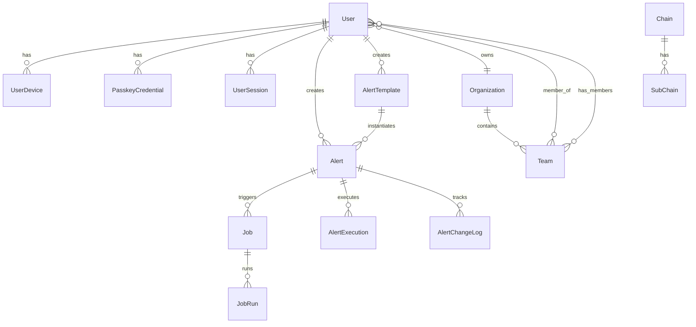

# Ekko API Models Documentation

This document provides comprehensive documentation for all Django models in the Ekko API.

## Table of Contents

1. [Authentication Models](#authentication-models)
2. [Alert System Models](#alert-system-models)
3. [Blockchain Models](#blockchain-models)
4. [Organization Models](#organization-models)
5. [Infrastructure Models](#infrastructure-models)
6. [Model Relationships](#model-relationships)
7. [Database Indexes](#database-indexes)

## Authentication Models

### User

Extended Django User model with Firebase integration and passwordless authentication.

```python
class User(AbstractUser):
    # Fields
    id = UUIDField(primary_key=True)
    email = EmailField(unique=True)
    firebase_uid = CharField(max_length=128, unique=True, null=True)
    display_name = CharField(max_length=255, blank=True)
    is_email_verified = BooleanField(default=False)
    created_at = DateTimeField(auto_now_add=True)
    updated_at = DateTimeField(auto_now=True)
    
    # Relationships
    devices → UserDevice (reverse FK)
    sessions → UserSession (reverse FK)
    passkeys → PasskeyCredential (reverse FK)
    organizations → Organization (M2M through membership)
    teams → Team (M2M through membership)
```

**Key Features:**
- UUID primary key for better distributed systems
- Firebase UID for email service integration
- No password field (passwordless system)
- Email as username

### UserDevice

Tracks devices for cross-device authentication and security.

```python
class UserDevice(Model):
    # Fields
    id = UUIDField(primary_key=True)
    user = ForeignKey(User)
    device_name = CharField(max_length=255)
    device_type = CharField(choices=['web', 'ios', 'android'])
    device_id = CharField(max_length=255, unique=True)
    last_seen = DateTimeField()
    is_trusted = BooleanField(default=False)
    created_at = DateTimeField(auto_now_add=True)
    
    # Metadata
    user_agent = TextField()
    ip_address = GenericIPAddressField()
    location = JSONField()  # {city, country, lat, lon}
```

### PasskeyCredential

Stores WebAuthn credentials for passwordless authentication.

```python
class PasskeyCredential(Model):
    # Fields
    id = UUIDField(primary_key=True)
    user = ForeignKey(User)
    credential_id = TextField(unique=True)  # Base64 encoded
    public_key = TextField()  # Base64 encoded
    sign_count = IntegerField(default=0)
    device_name = CharField(max_length=255)
    
    # Authenticator info
    aaguid = CharField(max_length=64)  # Authenticator ID
    attestation_format = CharField(max_length=32)
    transport_types = JSONField()  # ['internal', 'usb', 'nfc', 'ble']
    is_platform_authenticator = BooleanField()
    
    # Timestamps
    created_at = DateTimeField(auto_now_add=True)
    last_used = DateTimeField(null=True)
```

### UserSession

Active session tracking with Knox token integration.

```python
class UserSession(Model):
    # Fields
    id = UUIDField(primary_key=True)
    user = ForeignKey(User)
    device = ForeignKey(UserDevice)
    knox_token_key = CharField(max_length=8)  # First 8 chars of token
    
    # Session info
    started_at = DateTimeField(auto_now_add=True)
    last_activity = DateTimeField(auto_now=True)
    expires_at = DateTimeField()
    
    # Security
    ip_address = GenericIPAddressField()
    user_agent = TextField()
    is_active = BooleanField(default=True)
```

### EmailVerificationCode

Temporary codes for email verification and login.

```python
class EmailVerificationCode(Model):
    # Fields
    id = UUIDField(primary_key=True)
    email = EmailField(db_index=True)
    code = CharField(max_length=6)
    purpose = CharField(choices=['signup', 'login', 'recovery'])
    
    # Security
    attempts = IntegerField(default=0)
    max_attempts = IntegerField(default=5)
    expires_at = DateTimeField()
    used_at = DateTimeField(null=True)
    
    # Tracking
    ip_address = GenericIPAddressField()
    created_at = DateTimeField(auto_now_add=True)
```

## Alert System Models

### AlertTemplate

Reusable alert patterns with natural language processing.

```python
class AlertTemplate(Model):
    # Identity
    id = UUIDField(primary_key=True)
    name = CharField(max_length=255)
    description = TextField()
    
    # Template content
    nl_template = TextField()  # "Alert when {{wallet}} balance > {{threshold}}"
    spec_blueprint = JSONField()  # Polars code template with placeholders
    variables = JSONField()  # [{"name": "wallet", "type": "address", "required": true}]
    
    # Classification
    event_type = CharField(choices=EVENT_TYPE_CHOICES)
    sub_event = CharField(choices=SUB_EVENT_CHOICES)
    
    # Metadata
    version = IntegerField(default=1)
    usage_count = IntegerField(default=0)
    is_public = BooleanField(default=False)
    is_verified = BooleanField(default=False)  # Admin verified
    
    # Ownership
    created_by = ForeignKey(User)
    created_at = DateTimeField(auto_now_add=True)
    updated_at = DateTimeField(auto_now=True)
```

**Event Type Choices:**
- `ACCOUNT_EVENT`: Wallet/account related events
- `ASSET_EVENT`: Token/NFT events
- `CONTRACT_INTERACTION`: Smart contract events
- `PROTOCOL_EVENT`: Blockchain protocol events
- `DEFI_EVENT`: DeFi/application protocol events (e.g., Aave, Uniswap)
- `ANOMALY_EVENT`: Unusual activity detection

### Alert

Active alert instances created from templates or custom descriptions.

```python
class Alert(Model):
    # Identity
    id = UUIDField(primary_key=True)
    name = CharField(max_length=255)
    nl_description = TextField()  # Natural language description
    
    # Specification
    spec = JSONField()  # Complete alert specification
    """
    Example spec:
    {
        "version": "1.0",
        "event_type": "BALANCE_THRESHOLD",
        "conditions": {
            "balance": "> 100",
            "token": "AVAX"
        },
        "scope": {
            "chains": ["avalanche"],
            "addresses": ["0x123..."]
        },
        "actions": {
            "notify": ["email", "webhook"],
            "webhook_url": "https://..."
        }
    }
    """
    
    # State
    enabled = BooleanField(default=True)
    version = IntegerField(default=1)
    previous_version = ForeignKey('self', null=True)
    
    # Classification
    event_type = CharField(choices=EVENT_TYPE_CHOICES)
    sub_event = CharField(choices=SUB_EVENT_CHOICES)
    
    # Relationships
    user = ForeignKey(User)
    template = ForeignKey(AlertTemplate, null=True)
    
    # Timestamps
    created_at = DateTimeField(auto_now_add=True)
    updated_at = DateTimeField(auto_now=True)
    last_triggered = DateTimeField(null=True)
```

### Job

Background job processing for alerts.

```python
class Job(Model):
    # Identity
    id = UUIDField(primary_key=True)
    job_type = CharField(max_length=50)
    
    # Job data
    payload = JSONField()
    result = JSONField(null=True)
    error = TextField(null=True)
    
    # State
    status = CharField(choices=['pending', 'processing', 'completed', 'failed'])
    priority = CharField(choices=['high', 'normal', 'low'])
    
    # Execution
    attempts = IntegerField(default=0)
    max_attempts = IntegerField(default=3)
    retry_after = DateTimeField(null=True)
    
    # Relationships
    alert = ForeignKey(Alert, null=True)
    created_by = ForeignKey(User, null=True)
    
    # Timestamps
    created_at = DateTimeField(auto_now_add=True)
    started_at = DateTimeField(null=True)
    completed_at = DateTimeField(null=True)
```

### JobRun

Execution history for jobs.

```python
class JobRun(Model):
    # Identity
    id = UUIDField(primary_key=True)
    job = ForeignKey(Job)
    
    # Execution details
    attempt_number = IntegerField()
    status = CharField(choices=['started', 'completed', 'failed'])
    
    # Results
    output = JSONField(null=True)
    error = TextField(null=True)
    execution_time_ms = IntegerField(null=True)
    
    # System info
    worker_id = CharField(max_length=100)
    host_name = CharField(max_length=255)
    
    # Timestamps
    started_at = DateTimeField()
    completed_at = DateTimeField(null=True)
```

### AlertExecution

Records each time an alert is evaluated.

```python
class AlertExecution(Model):
    # Identity
    id = UUIDField(primary_key=True)
    alert = ForeignKey(Alert)
    alert_version = IntegerField()
    
    # Trigger
    trigger_type = CharField(choices=['blockchain_event', 'schedule', 'manual'])
    trigger_data = JSONField()
    
    # Results
    conditions_met = BooleanField()
    notifications_sent = IntegerField(default=0)
    
    # Performance
    execution_time_ms = IntegerField()
    data_points_processed = IntegerField()
    
    # Error handling
    error = TextField(null=True)
    
    # Timestamps
    started_at = DateTimeField()
    completed_at = DateTimeField()
```

### AlertChangeLog

Audit trail for alert modifications.

```python
class AlertChangeLog(Model):
    # Identity
    id = UUIDField(primary_key=True)
    alert = ForeignKey(Alert)
    
    # Change info
    from_version = IntegerField()
    to_version = IntegerField()
    change_type = CharField(choices=['created', 'updated', 'enabled', 'disabled'])
    
    # Details
    changed_fields = JSONField()  # ["name", "spec.conditions"]
    old_values = JSONField()
    new_values = JSONField()
    
    # Metadata
    changed_by = ForeignKey(User)
    change_reason = TextField(blank=True)
    created_at = DateTimeField(auto_now_add=True)
```

## Blockchain Models

### Chain

Supported blockchain networks.

```python
class Chain(Model):
    # Identity
    id = UUIDField(primary_key=True)
    name = CharField(max_length=50, unique=True)  # ethereum, bitcoin
    display_name = CharField(max_length=100)  # Ethereum, Bitcoin
    
    # Chain info
    chain_id = IntegerField(null=True)  # EVM chain ID
    chain_type = CharField(choices=['evm', 'utxo', 'svm', 'cosmos'])
    native_token = CharField(max_length=10)  # ETH, BTC
    
    # Configuration
    enabled = BooleanField(default=True)
    is_testnet = BooleanField(default=False)
    
    # Metadata
    icon_url = URLField(blank=True)
    explorer_url = URLField(blank=True)
    rpc_urls = JSONField(default=list)
    
    # Timestamps
    created_at = DateTimeField(auto_now_add=True)
    updated_at = DateTimeField(auto_now=True)
```

### SubChain

Network variants (mainnet, testnet, etc).

```python
class SubChain(Model):
    # Identity
    id = UUIDField(primary_key=True)
    chain = ForeignKey(Chain)
    name = CharField(max_length=50)  # mainnet, sepolia
    display_name = CharField(max_length=100)
    
    # Network info
    network_id = IntegerField()
    is_testnet = BooleanField(default=False)
    
    # Configuration
    enabled = BooleanField(default=True)
    rpc_urls = JSONField(default=list)
    ws_urls = JSONField(default=list)
    
    # Timestamps
    created_at = DateTimeField(auto_now_add=True)
```

## Organization Models

### Organization

Multi-tenant organization support.

```python
class Organization(Model):
    # Identity
    id = UUIDField(primary_key=True)
    name = CharField(max_length=255)
    slug = SlugField(unique=True)
    
    # Configuration
    max_teams = IntegerField(default=5)
    max_users = IntegerField(default=50)
    max_alerts_per_user = IntegerField(default=100)
    
    # Billing
    plan_type = CharField(choices=['free', 'pro', 'enterprise'])
    billing_email = EmailField()
    stripe_customer_id = CharField(max_length=100, blank=True)
    
    # Metadata
    website = URLField(blank=True)
    description = TextField(blank=True)
    
    # Relationships
    owner = ForeignKey(User)
    members = ManyToManyField(User, through='OrganizationMembership')
    
    # Timestamps
    created_at = DateTimeField(auto_now_add=True)
    updated_at = DateTimeField(auto_now=True)
```

### Team

Teams within organizations.

```python
class Team(Model):
    # Identity
    id = UUIDField(primary_key=True)
    organization = ForeignKey(Organization)
    name = CharField(max_length=255)
    slug = SlugField()
    
    # Configuration
    max_members = IntegerField(default=20)
    permissions = JSONField(default=dict)
    
    # Metadata
    description = TextField(blank=True)
    
    # Relationships
    members = ManyToManyField(User, through='TeamMembership')
    
    # Timestamps
    created_at = DateTimeField(auto_now_add=True)
    updated_at = DateTimeField(auto_now=True)
    
    class Meta:
        unique_together = [['organization', 'slug']]
```

### TeamMembership

User membership in teams with roles.

```python
class TeamMembership(Model):
    # Identity
    id = UUIDField(primary_key=True)
    team = ForeignKey(Team)
    user = ForeignKey(User)
    
    # Role
    role = CharField(choices=['owner', 'admin', 'member', 'viewer'])
    
    # Permissions
    custom_permissions = JSONField(default=dict)
    
    # Metadata
    invited_by = ForeignKey(User, related_name='invitations_sent')
    joined_at = DateTimeField(auto_now_add=True)
    
    class Meta:
        unique_together = [['team', 'user']]
```

## Infrastructure Models

### NATSConnection

NATS messaging system connections.

```python
class NATSConnection(Model):
    # Identity
    id = UUIDField(primary_key=True)
    name = CharField(max_length=100, unique=True)
    
    # Connection
    url = CharField(max_length=255)  # nats://localhost:4222
    cluster_id = CharField(max_length=100, blank=True)
    client_id = CharField(max_length=100)
    
    # Authentication
    auth_type = CharField(choices=['none', 'token', 'user_pass', 'tls'])
    credentials = JSONField(null=True)  # Encrypted
    
    # State
    is_active = BooleanField(default=True)
    last_connected = DateTimeField(null=True)
    last_error = TextField(blank=True)
    
    # Monitoring
    messages_published = BigIntegerField(default=0)
    messages_received = BigIntegerField(default=0)
    bytes_sent = BigIntegerField(default=0)
    bytes_received = BigIntegerField(default=0)
    
    # Timestamps
    created_at = DateTimeField(auto_now_add=True)
    updated_at = DateTimeField(auto_now=True)
```

### AuditLog

Comprehensive audit logging.

```python
class AuditLog(Model):
    # Identity
    id = UUIDField(primary_key=True)
    
    # Event
    event_type = CharField(max_length=100)  # user.login, alert.created
    event_data = JSONField()
    
    # Actor
    user = ForeignKey(User, null=True)
    ip_address = GenericIPAddressField(null=True)
    user_agent = TextField(blank=True)
    
    # Target
    target_type = CharField(max_length=50)  # alert, user, organization
    target_id = UUIDField(null=True)
    
    # Result
    success = BooleanField(default=True)
    error_message = TextField(blank=True)
    
    # Timestamp
    created_at = DateTimeField(auto_now_add=True)
    
    class Meta:
        indexes = [
            models.Index(fields=['event_type', '-created_at']),
            models.Index(fields=['user', '-created_at']),
            models.Index(fields=['target_type', 'target_id']),
        ]
```

## Model Relationships



## Database Indexes

### Performance Indexes

```python
# Authentication
- User.email (unique)
- User.firebase_uid (unique)
- UserDevice.device_id (unique)
- PasskeyCredential.credential_id (unique)
- EmailVerificationCode.email
- UserSession.user_id, is_active

# Alerts
- AlertTemplate.event_type, sub_event
- AlertTemplate.is_public, is_verified
- Alert.user_id, enabled
- Alert.event_type, sub_event
- Job.status, priority
- Job.alert_id
- AlertExecution.alert_id, started_at

# Blockchain
- Chain.name (unique)
- Chain.enabled

# Organizations
- Organization.slug (unique)
- Team.organization_id, slug (unique together)
- TeamMembership.team_id, user_id (unique together)

# Audit
- AuditLog.event_type, created_at
- AuditLog.user_id, created_at
- AuditLog.target_type, target_id
```

### Query Optimization

Common query patterns and their optimizations:

```python
# Get user's active alerts
Alert.objects.filter(
    user=user,
    enabled=True
).select_related('template').prefetch_related('jobs')

# Get organization's team members
TeamMembership.objects.filter(
    team__organization=org
).select_related('user', 'team')

# Get recent alert executions
AlertExecution.objects.filter(
    alert__user=user,
    started_at__gte=timezone.now() - timedelta(days=7)
).select_related('alert').order_by('-started_at')
```

## Data Types and Constraints

### JSON Field Schemas

**Alert Spec Schema:**
```json
{
  "version": "string",
  "event_type": "string",
  "conditions": {
    "type": "object",
    "additionalProperties": true
  },
  "scope": {
    "chains": ["string"],
    "addresses": ["string"],
    "contracts": ["string"]
  },
  "actions": {
    "notify": ["email", "sms", "webhook"],
    "webhook_url": "string",
    "webhook_headers": {"string": "string"}
  }
}
```

**Alert Template Variables Schema:**
```json
[
  {
    "name": "string",
    "type": "string",  // address, number, string, boolean
    "required": "boolean",
    "default": "any",
    "validation": {
      "min": "number",
      "max": "number",
      "pattern": "string"
    }
  }
]
```

### Validation Rules

1. **Email Verification Codes:**
   - 6 digits only
   - 10-minute expiry
   - 5 attempts maximum

2. **Alert Names:**
   - 3-255 characters
   - Alphanumeric + spaces + common punctuation

3. **Team Slugs:**
   - Lowercase letters, numbers, hyphens
   - Unique within organization

4. **Wallet Addresses:**
   - Validated per blockchain type
   - EVM: 42 characters (0x + 40 hex)
   - Bitcoin: Various formats supported

## Migration Considerations

### Adding Indexes
```python
class Migration(migrations.Migration):
    operations = [
        migrations.AddIndex(
            model_name='alert',
            index=models.Index(
                fields=['user', 'enabled', '-created_at'],
                name='alert_user_active_idx'
            ),
        ),
    ]
```

### Data Migrations
```python
def populate_alert_versions(apps, schema_editor):
    Alert = apps.get_model('app', 'Alert')
    for alert in Alert.objects.filter(version__isnull=True):
        alert.version = 1
        alert.save(update_fields=['version'])
```

### Backwards Compatibility
- Always add nullable fields first
- Populate data in separate migration
- Then add constraints if needed

## Performance Considerations

1. **N+1 Query Prevention:**
   - Use `select_related()` for ForeignKeys
   - Use `prefetch_related()` for reverse FKs and M2M

2. **Bulk Operations:**
   ```python
   # Good
   Alert.objects.bulk_create([...])
   
   # Bad
   for data in alert_data:
       Alert.objects.create(**data)
   ```

3. **Database Connections:**
   - Use connection pooling
   - Set appropriate timeouts
   - Monitor slow queries

4. **Caching Strategy:**
   - Cache user permissions
   - Cache alert templates
   - Cache blockchain configurations
