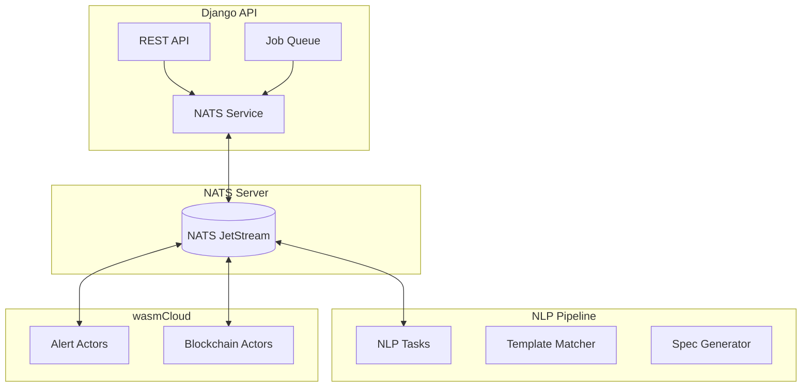
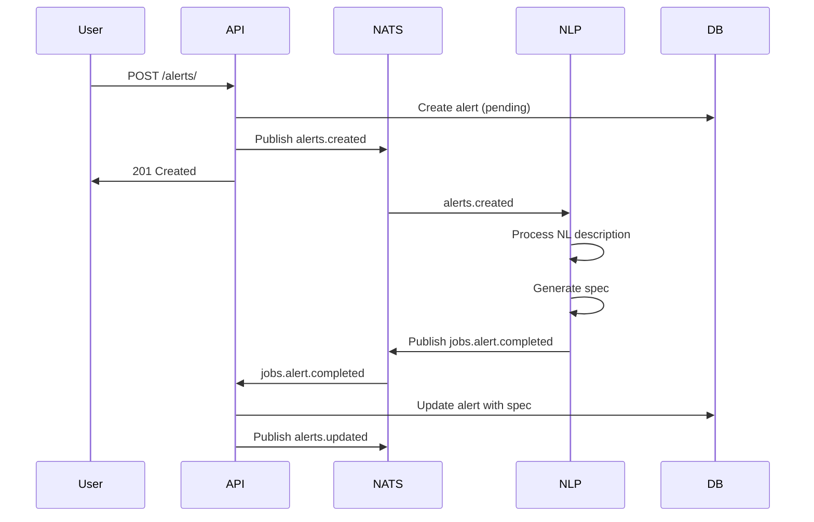
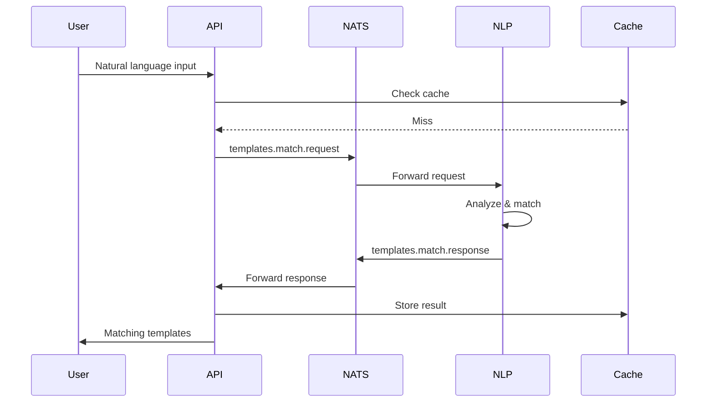

# NATS Integration and Event-Driven Architecture

## Overview

The Ekko platform uses NATS as its central messaging backbone for event-driven communication between services. This document covers the NATS integration patterns, message flows, and best practices.

## Architecture Overview



## NATS Configuration

### Django Settings

```python
# settings/base.py
NATS_CONFIG = {
    'url': env('NATS_URL', default='nats://localhost:4222'),
    'user': env('NATS_USER', default=''),
    'password': env('NATS_PASSWORD', default=''),
    'token': env('NATS_TOKEN', default=''),
    'max_reconnect_attempts': env('NATS_MAX_RECONNECT_ATTEMPTS', default=10),
    'reconnect_time_wait': env('NATS_RECONNECT_TIME_WAIT', default=2),
    'connection_timeout': 5,
    'drain_timeout': 30,
    'ping_interval': 120,
    'max_outstanding_pings': 2,
}

# JetStream configuration
JETSTREAM_CONFIG = {
    'streams': {
        'ALERTS': {
            'subjects': ['alerts.*'],
            'retention': 'limits',
            'max_msgs': 1000000,
            'max_age': 86400 * 7,  # 7 days
            'storage': 'file',
            'replicas': 3,
        },
        'JOBS': {
            'subjects': ['jobs.*'],
            'retention': 'workqueue',
            'max_msgs': 100000,
            'storage': 'file',
            'replicas': 3,
        },
        'TEMPLATES': {
            'subjects': ['templates.*'],
            'retention': 'limits',
            'max_msgs': 50000,
            'storage': 'file',
            'replicas': 3,
        }
    }
}
```

### Connection Management

```python
# app/services/nats_service.py
import asyncio
import json
import logging
from typing import Optional, Dict, Any
import nats
from nats.js import JetStreamContext
from django.conf import settings

logger = logging.getLogger(__name__)

class NATSService:
    """Singleton NATS connection manager"""
    
    _instance = None
    _nc: Optional[nats.NATS] = None
    _js: Optional[JetStreamContext] = None
    
    def __new__(cls):
        if cls._instance is None:
            cls._instance = super().__new__(cls)
        return cls._instance
    
    async def connect(self):
        """Establish NATS connection with retry logic"""
        if self._nc and self._nc.is_connected:
            return
        
        try:
            self._nc = await nats.connect(
                servers=settings.NATS_CONFIG['url'],
                user=settings.NATS_CONFIG.get('user'),
                password=settings.NATS_CONFIG.get('password'),
                token=settings.NATS_CONFIG.get('token'),
                max_reconnect_attempts=settings.NATS_CONFIG['max_reconnect_attempts'],
                reconnect_time_wait=settings.NATS_CONFIG['reconnect_time_wait'],
                error_cb=self._error_callback,
                disconnected_cb=self._disconnected_callback,
                reconnected_cb=self._reconnected_callback,
            )
            
            # Initialize JetStream
            self._js = self._nc.jetstream()
            
            # Create streams if they don't exist
            await self._ensure_streams()
            
            logger.info("NATS connection established")
            
        except Exception as e:
            logger.error(f"Failed to connect to NATS: {e}")
            raise
    
    async def _ensure_streams(self):
        """Create JetStream streams if they don't exist"""
        for stream_name, config in settings.JETSTREAM_CONFIG['streams'].items():
            try:
                await self._js.stream_info(stream_name)
                logger.info(f"Stream {stream_name} already exists")
            except:
                await self._js.add_stream(
                    name=stream_name,
                    subjects=config['subjects'],
                    retention=config['retention'],
                    max_msgs=config['max_msgs'],
                    max_age=config.get('max_age'),
                    storage=config['storage'],
                    num_replicas=config['replicas'],
                )
                logger.info(f"Created stream {stream_name}")
    
    async def publish(self, subject: str, data: Dict[str, Any]):
        """Publish message to NATS"""
        if not self._nc or not self._nc.is_connected:
            await self.connect()
        
        try:
            message = json.dumps(data).encode()
            ack = await self._js.publish(subject, message)
            logger.debug(f"Published to {subject}: {ack.seq}")
            return ack
        except Exception as e:
            logger.error(f"Failed to publish to {subject}: {e}")
            raise
    
    async def subscribe(self, subject: str, callback):
        """Subscribe to NATS subject"""
        if not self._nc or not self._nc.is_connected:
            await self.connect()
        
        try:
            sub = await self._nc.subscribe(subject, cb=callback)
            logger.info(f"Subscribed to {subject}")
            return sub
        except Exception as e:
            logger.error(f"Failed to subscribe to {subject}: {e}")
            raise
    
    def _error_callback(self, e):
        logger.error(f"NATS error: {e}")
    
    def _disconnected_callback(self):
        logger.warning("NATS disconnected")
    
    def _reconnected_callback(self):
        logger.info("NATS reconnected")

# Singleton instance
nats_service = NATSService()
```

## Message Subjects and Patterns

### Subject Naming Convention

```
<domain>.<entity>.<action>.<detail>

Examples:
- alerts.created
- alerts.updated
- alerts.enabled
- alerts.disabled
- alerts.template.matched
- jobs.alert.created
- jobs.alert.completed
- templates.match.request
- templates.match.response
```

### Message Formats

#### Alert Created Message

**Subject:** `alerts.created`

```json
{
  "id": "550e8400-e29b-41d4-a716-446655440000",
  "timestamp": "2025-01-01T10:00:00Z",
  "user_id": "user-uuid",
  "alert": {
    "id": "alert-uuid",
    "name": "AVAX Balance Alert",
    "nl_description": "Alert me when my AVAX balance goes above 10",
    "event_type": "ACCOUNT_EVENT",
    "sub_event": "BALANCE_THRESHOLD",
    "template_id": null
  },
  "correlation_id": "req-12345"
}
```

#### Template Match Request

**Subject:** `templates.match.request`

```json
{
  "id": "request-uuid",
  "timestamp": "2025-01-01T10:00:00Z",
  "nl_description": "Alert me when ETH gas is below 50 gwei",
  "user_id": "user-uuid",
  "correlation_id": "req-12345"
}
```

#### Template Match Response

**Subject:** `templates.match.response`

```json
{
  "request_id": "request-uuid",
  "timestamp": "2025-01-01T10:00:01Z",
  "matches": [
    {
      "template_id": "template-uuid",
      "confidence": 0.95,
      "parameters": {
        "threshold": 50,
        "unit": "gwei"
      }
    }
  ],
  "correlation_id": "req-12345"
}
```

#### Job Created Message

**Subject:** `jobs.alert.created`

```json
{
  "job": {
    "id": "job-uuid",
    "type": "process_alert_spec",
    "priority": "normal",
    "payload": {
      "alert_id": "alert-uuid",
      "nl_description": "Alert me when...",
      "event_type": "ACCOUNT_EVENT"
    }
  },
  "timestamp": "2025-01-01T10:00:00Z"
}
```

## Event Flows

### Alert Creation Flow



### Template Matching Flow



## Implementation Patterns

### Publishing Messages

```python
# Synchronous wrapper for Django views
def publish_alert_created_sync(alert):
    """Publish alert created event synchronously"""
    try:
        loop = asyncio.new_event_loop()
        asyncio.set_event_loop(loop)
        
        message = {
            'id': str(uuid.uuid4()),
            'timestamp': timezone.now().isoformat(),
            'user_id': str(alert.user_id),
            'alert': {
                'id': str(alert.id),
                'name': alert.name,
                'nl_description': alert.nl_description,
                'event_type': alert.event_type,
                'sub_event': alert.sub_event,
                'template_id': str(alert.template_id) if alert.template_id else None
            }
        }
        
        loop.run_until_complete(
            nats_service.publish('alerts.created', message)
        )
        
    except Exception as e:
        logger.error(f"Failed to publish alert created: {e}")
        # Don't fail the request, just log
    finally:
        loop.close()

# Usage in views
class AlertViewSet(viewsets.ModelViewSet):
    def perform_create(self, serializer):
        alert = serializer.save()
        publish_alert_created_sync(alert)
```

### Subscribing to Messages

```python
# Django management command for NATS subscriber
# management/commands/nats_subscriber.py
import asyncio
from django.core.management.base import BaseCommand
from app.services.nats_service import nats_service

class Command(BaseCommand):
    help = 'Run NATS subscriber for processing messages'
    
    def handle(self, *args, **options):
        asyncio.run(self.run_subscriber())
    
    async def run_subscriber(self):
        await nats_service.connect()
        
        # Subscribe to job completion messages
        await nats_service.subscribe(
            'jobs.alert.completed',
            self.handle_job_completed
        )
        
        # Keep running
        try:
            await asyncio.Future()
        except KeyboardInterrupt:
            pass
    
    async def handle_job_completed(self, msg):
        """Handle job completion messages"""
        try:
            data = json.loads(msg.data.decode())
            job_id = data['job']['id']
            result = data['result']
            
            # Update job in database
            await self.update_job(job_id, result)
            
            # Acknowledge message
            await msg.ack()
            
        except Exception as e:
            logger.error(f"Error handling message: {e}")
            # Don't ack - let it retry
```

### Request-Reply Pattern

```python
async def request_template_match(nl_description: str, user_id: str):
    """Request template matching with timeout"""
    request_id = str(uuid.uuid4())
    
    # Create request
    request = {
        'id': request_id,
        'timestamp': timezone.now().isoformat(),
        'nl_description': nl_description,
        'user_id': user_id,
        'correlation_id': request_id
    }
    
    # Set up reply subscription
    reply_subject = f'templates.match.response.{request_id}'
    future = asyncio.Future()
    
    async def handle_reply(msg):
        data = json.loads(msg.data.decode())
        future.set_result(data)
    
    # Subscribe to reply
    sub = await nats_service.subscribe(reply_subject, handle_reply)
    
    # Publish request with reply-to
    await nats_service._nc.publish(
        'templates.match.request',
        json.dumps(request).encode(),
        reply=reply_subject
    )
    
    try:
        # Wait for reply with timeout
        result = await asyncio.wait_for(future, timeout=5.0)
        return result
    except asyncio.TimeoutError:
        logger.error(f"Template match timeout for {request_id}")
        return None
    finally:
        await sub.unsubscribe()
```

## Error Handling and Resilience

### Retry Logic

```python
class RetryableNATSPublisher:
    def __init__(self, max_retries=3, backoff_factor=2):
        self.max_retries = max_retries
        self.backoff_factor = backoff_factor
    
    async def publish_with_retry(self, subject: str, data: dict):
        """Publish with exponential backoff retry"""
        last_error = None
        
        for attempt in range(self.max_retries):
            try:
                return await nats_service.publish(subject, data)
            except Exception as e:
                last_error = e
                if attempt < self.max_retries - 1:
                    wait_time = self.backoff_factor ** attempt
                    logger.warning(
                        f"Publish failed, retry {attempt + 1}/{self.max_retries} "
                        f"in {wait_time}s: {e}"
                    )
                    await asyncio.sleep(wait_time)
                else:
                    logger.error(f"All retries failed: {e}")
        
        raise last_error
```

### Dead Letter Queue

```python
# Configure DLQ in JetStream
DLQ_CONFIG = {
    'name': 'DLQ',
    'subjects': ['dlq.*'],
    'retention': 'limits',
    'max_msgs': 100000,
    'max_age': 86400 * 30,  # 30 days
}

async def handle_failed_message(subject: str, data: dict, error: str):
    """Send failed messages to DLQ"""
    dlq_message = {
        'original_subject': subject,
        'data': data,
        'error': error,
        'failed_at': timezone.now().isoformat(),
        'attempts': data.get('_attempts', 1)
    }
    
    await nats_service.publish(f'dlq.{subject}', dlq_message)
```

### Circuit Breaker

```python
class CircuitBreaker:
    def __init__(self, failure_threshold=5, recovery_timeout=60):
        self.failure_threshold = failure_threshold
        self.recovery_timeout = recovery_timeout
        self.failure_count = 0
        self.last_failure_time = None
        self.state = 'closed'  # closed, open, half-open
    
    async def call(self, func, *args, **kwargs):
        if self.state == 'open':
            if self._should_attempt_reset():
                self.state = 'half-open'
            else:
                raise Exception("Circuit breaker is open")
        
        try:
            result = await func(*args, **kwargs)
            self._on_success()
            return result
        except Exception as e:
            self._on_failure()
            raise
    
    def _should_attempt_reset(self):
        return (
            self.last_failure_time and
            time.time() - self.last_failure_time >= self.recovery_timeout
        )
    
    def _on_success(self):
        self.failure_count = 0
        self.state = 'closed'
    
    def _on_failure(self):
        self.failure_count += 1
        self.last_failure_time = time.time()
        
        if self.failure_count >= self.failure_threshold:
            self.state = 'open'
            logger.error(f"Circuit breaker opened after {self.failure_count} failures")
```

## Monitoring and Observability

### Metrics Collection

```python
from prometheus_client import Counter, Histogram, Gauge

# Define metrics
nats_messages_published = Counter(
    'nats_messages_published_total',
    'Total NATS messages published',
    ['subject']
)

nats_messages_received = Counter(
    'nats_messages_received_total',
    'Total NATS messages received',
    ['subject']
)

nats_message_processing_duration = Histogram(
    'nats_message_processing_seconds',
    'Message processing duration',
    ['subject']
)

nats_connection_status = Gauge(
    'nats_connection_status',
    'NATS connection status (1=connected, 0=disconnected)'
)

# Instrument publish method
async def publish_with_metrics(subject: str, data: dict):
    start_time = time.time()
    try:
        result = await nats_service.publish(subject, data)
        nats_messages_published.labels(subject=subject).inc()
        return result
    except Exception as e:
        nats_messages_published.labels(subject=subject).inc()
        raise
    finally:
        duration = time.time() - start_time
        nats_message_processing_duration.labels(subject=subject).observe(duration)
```

### Logging Best Practices

```python
import structlog

logger = structlog.get_logger()

async def handle_message_with_logging(msg):
    """Process message with structured logging"""
    log = logger.bind(
        subject=msg.subject,
        reply=msg.reply,
        headers=msg.headers
    )
    
    try:
        data = json.loads(msg.data.decode())
        log = log.bind(
            message_id=data.get('id'),
            correlation_id=data.get('correlation_id')
        )
        
        log.info("Processing message")
        
        # Process message
        result = await process_message(data)
        
        log.info("Message processed successfully", result=result)
        
    except json.JSONDecodeError as e:
        log.error("Invalid JSON in message", error=str(e))
    except Exception as e:
        log.error("Failed to process message", error=str(e), exc_info=True)
```

## Testing NATS Integration

### Unit Testing with Mocks

```python
import pytest
from unittest.mock import AsyncMock, patch
from app.services.nats_service import NATSService

@pytest.mark.asyncio
async def test_publish_alert_created():
    # Mock NATS service
    mock_nats = AsyncMock()
    mock_js = AsyncMock()
    mock_nats.jetstream.return_value = mock_js
    
    with patch('app.services.nats_service.nats.connect', return_value=mock_nats):
        service = NATSService()
        await service.connect()
        
        # Test publish
        alert_data = {
            'id': 'test-alert',
            'name': 'Test Alert'
        }
        
        await service.publish('alerts.created', alert_data)
        
        # Verify
        mock_js.publish.assert_called_once()
        args = mock_js.publish.call_args
        assert args[0][0] == 'alerts.created'
        assert json.loads(args[0][1]) == alert_data
```

### Integration Testing

```python
import docker
import pytest

@pytest.fixture
async def nats_container():
    """Start NATS container for testing"""
    client = docker.from_env()
    container = client.containers.run(
        'nats:latest',
        command='-js',
        ports={'4222/tcp': None},
        detach=True,
        remove=True
    )
    
    # Wait for NATS to be ready
    await asyncio.sleep(2)
    
    # Get mapped port
    port = container.ports['4222/tcp'][0]['HostPort']
    
    yield f'nats://localhost:{port}'
    
    # Cleanup
    container.stop()

@pytest.mark.asyncio
async def test_nats_integration(nats_container):
    """Test real NATS integration"""
    # Override NATS URL
    with patch('django.conf.settings.NATS_CONFIG', {'url': nats_container}):
        service = NATSService()
        await service.connect()
        
        # Test publish/subscribe
        received_messages = []
        
        async def handler(msg):
            received_messages.append(json.loads(msg.data.decode()))
        
        await service.subscribe('test.subject', handler)
        await service.publish('test.subject', {'test': 'data'})
        
        # Wait for message
        await asyncio.sleep(0.1)
        
        assert len(received_messages) == 1
        assert received_messages[0] == {'test': 'data'}
```

## Production Deployment

### High Availability Setup

```yaml
# docker-compose.prod.yml
version: '3.8'

services:
  nats-1:
    image: nats:latest
    command: |
      -js
      -cluster_name NATS
      -cluster nats://0.0.0.0:6222
      -routes nats://nats-2:6222,nats://nats-3:6222
    volumes:
      - nats-1-data:/data
    ports:
      - "4222:4222"

  nats-2:
    image: nats:latest
    command: |
      -js
      -cluster_name NATS
      -cluster nats://0.0.0.0:6222
      -routes nats://nats-1:6222,nats://nats-3:6222
    volumes:
      - nats-2-data:/data

  nats-3:
    image: nats:latest
    command: |
      -js
      -cluster_name NATS
      -cluster nats://0.0.0.0:6222
      -routes nats://nats-1:6222,nats://nats-2:6222
    volumes:
      - nats-3-data:/data

volumes:
  nats-1-data:
  nats-2-data:
  nats-3-data:
```

### Security Configuration

```yaml
# nats-server.conf
port: 4222
monitor_port: 8222

jetstream {
  store_dir: /data
  max_mem: 1G
  max_file: 10G
}

authorization {
  users = [
    {
      user: django_api
      password: $2a$11$... # bcrypt hash
      permissions: {
        publish: ["alerts.*", "jobs.*", "templates.*"]
        subscribe: ["alerts.*", "jobs.*", "templates.*"]
      }
    },
    {
      user: nlp_processor
      password: $2a$11$...
      permissions: {
        publish: ["ws.events"]
        subscribe: ["alerts.created"]
      }
    }
  ]
}

# TLS configuration
tls {
  cert_file: "/certs/server-cert.pem"
  key_file: "/certs/server-key.pem"
  ca_file: "/certs/ca.pem"
  verify: true
}
```

### Performance Tuning

```python
# Optimal settings for production
NATS_PRODUCTION_CONFIG = {
    # Connection pool
    'max_connections': 10,
    'connection_timeout': 5,
    
    # Message settings
    'max_payload': 1048576,  # 1MB
    'max_pending': 65536,
    
    # JetStream settings
    'js_timeout': 5,
    'js_max_retries': 3,
    
    # Performance
    'no_echo': True,  # Don't receive own messages
    'pedantic': False,  # Relaxed protocol for performance
}
```

## Best Practices

1. **Always use JetStream** for durability and exactly-once semantics
2. **Implement idempotency** - Messages may be delivered more than once
3. **Use correlation IDs** for request tracking across services
4. **Set reasonable timeouts** for request-reply patterns
5. **Monitor queue depths** to detect processing issues
6. **Use subject hierarchies** for flexible routing
7. **Implement graceful shutdown** to drain messages
8. **Version your message schemas** for backward compatibility
9. **Use dead letter queues** for failed message handling
10. **Test failure scenarios** including network partitions

## Troubleshooting

### Common Issues

1. **Connection Timeouts**
   - Check network connectivity
   - Verify NATS server is running
   - Check firewall rules

2. **Message Loss**
   - Ensure using JetStream
   - Check acknowledgment handling
   - Verify stream retention settings

3. **High Latency**
   - Monitor queue depths
   - Check consumer performance
   - Scale consumers if needed

4. **Authentication Failures**
   - Verify credentials
   - Check user permissions
   - Review NATS server logs

### Debug Commands

```bash
# Check NATS server status
nats-cli server info

# List streams
nats-cli stream list

# View stream info
nats-cli stream info ALERTS

# Monitor subjects
nats-cli sub "alerts.*"

# Check consumer status
nats-cli consumer info ALERTS nlp-processor
```
