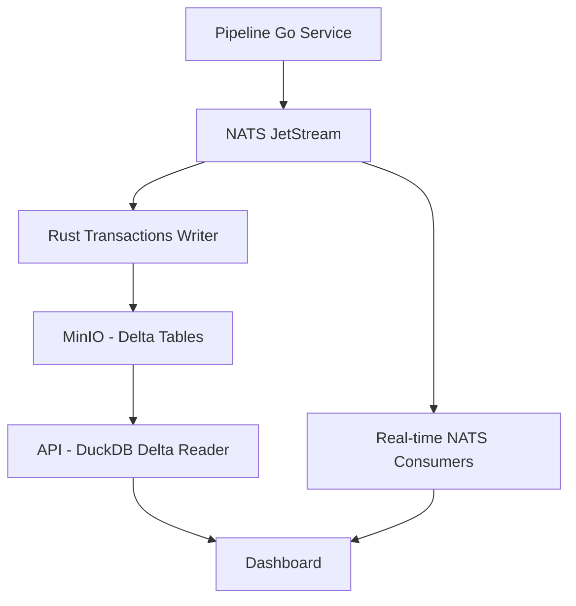
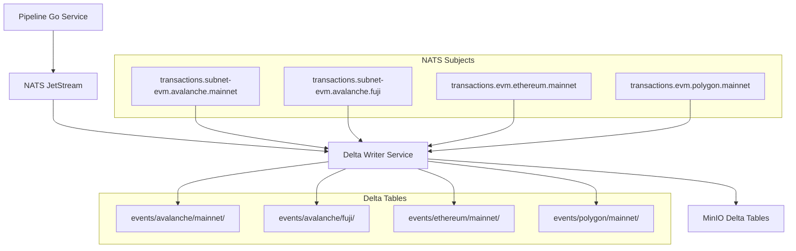
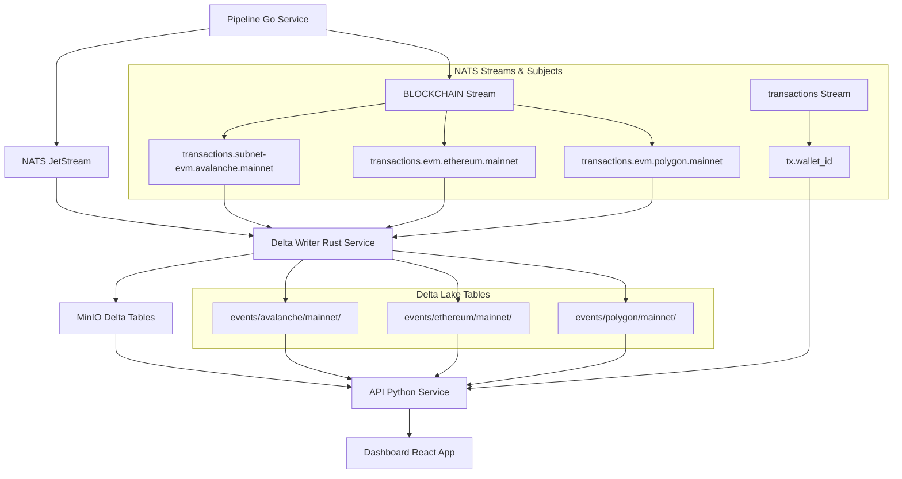

# Ekko Transactions Writer Service

A high-performance Rust service that consumes blockchain transaction events from NATS and writes them to Delta Lake tables stored in MinIO/S3. This service implements a modern event-driven architecture with network/subnet isolation for optimal performance and scalability.

## 🎯 Architecture Overview

### Event-Driven Delta Lake Architecture



### Network/Subnet Table Structure

The service organizes Delta tables by network and subnet for optimal performance and management:

```
s3://blockchain-events/
├── events/
│   ├── avalanche/
│   │   ├── mainnet/          # Delta table for Avalanche Mainnet
│   │   └── fuji/             # Delta table for Avalanche Fuji testnet
│   ├── ethereum/
│   │   ├── mainnet/          # Delta table for Ethereum Mainnet
│   │   └── goerli/           # Delta table for Ethereum Goerli testnet
│   └── polygon/
│       ├── mainnet/          # Delta table for Polygon Mainnet
│       └── mumbai/           # Delta table for Polygon Mumbai testnet
```

## 🚀 Key Features

### ✅ Network Isolation
- **Separate tables** per network/subnet combination
- **Better performance** - queries only scan relevant data
- **Easier management** - can manage each network independently
- **Scalability** - can scale different networks differently

### ✅ Event Schema
- **Standardized format** across all blockchain networks
- **Flexible details** field for network-specific data
- **Entity-centric** design for efficient wallet queries
- **Rich metadata** for analytics and partitioning

### ✅ High Performance
- **Rust implementation** for maximum throughput
- **Batched writes** with configurable batch sizes
- **Connection pooling** and async processing
- **Automatic partitioning** by event_type, year, month, day

### ✅ Reliability
- **ACID transactions** via Delta Lake
- **Automatic retries** with exponential backoff
- **Health checks** and metrics monitoring
- **Graceful shutdown** with buffer flushing

## 📊 Event Schema

### Standardized Event Structure

```json
{
  "event_type": "wallet_tx",
  "entity": {
    "type": "wallet",
    "chain": "avax",
    "address": "0xabc123..."
  },
  "timestamp": "2025-06-03T12:34:56Z",
  "tx_hash": "0xdef456...",
  "details": {
    "from": "0xabc123...",
    "to": "0xdeadbeef...",
    "value": "1000000000000000000",
    "token": "AVAX",
    "direction": "out",
    "tx_type": "send"
  },
  "metadata": {
    "network": "Avalanche",
    "subnet": "Mainnet",
    "block_number": 12345,
    "block_hash": "0x...",
    "tx_index": 0
  }
}
```

### Supported Event Types

- `wallet_tx` - Wallet transaction events
- `token_transfer` - ERC20/token transfer events
- `contract_call` - Smart contract interaction events
- `nft_transfer` - NFT transfer events
- `staking` - Staking/delegation events
- `swap` - DEX swap events
- `defi` - DeFi protocol events

## 🔧 Configuration

### Environment Variables

```bash
# Service Configuration
SERVICE_NAME=transactions-writer
METRICS_PORT=9090

# NATS Configuration
NATS_URL=nats://nats:4222
NATS_SUBJECT=transactions.>
NATS_CONSUMER_NAME=transactions-writer
NATS_STREAM_NAME=transactions

# MinIO/S3 Configuration
S3_ENDPOINT=http://minio:9000
S3_ACCESS_KEY=minioadmin
S3_SECRET_KEY=minioadmin
S3_REGION=us-east-1  # Not required for MinIO but some clients expect it
S3_BUCKET=blockchain-events
S3_USE_SSL=false

# Delta Lake Configuration
DELTA_TABLE_BASE_PATH=events  # Tables created at events/{network}/{subnet}
BATCH_SIZE=1000
FLUSH_INTERVAL_SECONDS=30
MAX_CONCURRENT_WRITES=4

# Processing Configuration
WORKER_THREADS=4
BUFFER_SIZE=10000
RETRY_ATTEMPTS=3
RETRY_DELAY_MS=1000

# Logging
RUST_LOG=info,ekko_delta_writer=debug
```

## 🐳 Docker Deployment

### Using Docker Compose

```yaml
transactions-writer:
  build:
    context: ./delta-writer
    dockerfile: Dockerfile
  environment:
    - SERVICE_NAME=transactions-writer
    - NATS_URL=nats://nats:4222
    - S3_ENDPOINT=http://minio:9000
    - S3_BUCKET=blockchain-events
    - DELTA_TABLE_BASE_PATH=events
  ports:
    - "9090:9090"  # Metrics port
  depends_on:
    - nats
    - minio
```

### Health Checks

The service exposes health checks via Prometheus metrics:

```bash
curl http://localhost:9090/metrics
```

## 📈 Performance Benefits

### Query Performance Comparison

**Before (Flat Structure):**
```sql
-- Scans all transaction data
SELECT * FROM transactions 
WHERE from_address = '0x123...' 
  AND network = 'Avalanche'
```

**After (Network/Subnet Tables):**
```sql
-- Only scans Avalanche mainnet data
SELECT * FROM delta_scan('s3://blockchain-events/events/avalanche/mainnet')
WHERE entity_address = '0x123...'
```

### Storage Efficiency

- **Partitioned by**: event_type, year, month, day
- **Compressed**: ZSTD compression for optimal storage
- **Indexed**: Entity-based indexing for fast wallet queries
- **Versioned**: Delta Lake provides time travel and ACID transactions

## 📡 NATS Subjects & Consumers Map

### Subject Patterns

The system uses a hierarchical subject pattern for organizing blockchain transaction data:

#### Production Subject Format
```
transactions.{vmtype}.{network}.{subnet}
```

#### Test Subject Format
```
transactions.test.{vmtype}.{network}.{subnet}
```

### Supported Networks & Subjects

| **Network** | **Subnet** | **VM Type** | **Subject Pattern** | **Stream** | **Consumer** |
|-------------|------------|-------------|-------------------|------------|--------------|
| **Avalanche** | Mainnet | subnet-evm | `transactions.subnet-evm.avalanche.mainnet` | `BLOCKCHAIN` | `transactions-writer` |
| **Avalanche** | Fuji | subnet-evm | `transactions.subnet-evm.avalanche.fuji` | `BLOCKCHAIN` | `transactions-writer` |
| **Ethereum** | Mainnet | evm | `transactions.evm.ethereum.mainnet` | `BLOCKCHAIN` | `transactions-writer` |
| **Ethereum** | Goerli | evm | `transactions.evm.ethereum.goerli` | `BLOCKCHAIN` | `transactions-writer` |
| **Polygon** | Mainnet | evm | `transactions.evm.polygon.mainnet` | `BLOCKCHAIN` | `transactions-writer` |
| **Polygon** | Mumbai | evm | `transactions.evm.polygon.mumbai` | `BLOCKCHAIN` | `transactions-writer` |

### Stream & Consumer Configuration

#### Primary Streams

| **Stream Name** | **Subjects** | **Purpose** | **Retention** | **Storage** |
|-----------------|--------------|-------------|---------------|-------------|
| `BLOCKCHAIN` | `transactions.>` | All blockchain transactions | 24h | File |
| `transactions-test` | `transactions.test.>` | Test transactions | 24h | File |

#### Consumers

| **Consumer Name** | **Stream** | **Subject Filter** | **Service** | **Ack Policy** |
|-------------------|------------|-------------------|-------------|----------------|
| `transactions-writer` | `BLOCKCHAIN` | `transactions.>` | Delta Writer | Explicit |
| `transactions-writer-test` | `transactions-test` | `transactions.test.>` | Delta Writer (Test) | Explicit |
| `api-processor` | `transactions` | `tx.*` | API Service | Explicit |

### Subject Parsing Logic

The Delta Writer service parses subjects to determine storage location:

```rust
// Production: transactions.subnet-evm.avalanche.mainnet
//            └─ vmtype ──┘ └─ network ─┘ └─ subnet ─┘
// Result: network="avalanche", subnet="mainnet"

// Test: transactions.test.subnet-evm.avalanche.mainnet
//       └─ test ─┘ └─ vmtype ──┘ └─ network ─┘ └─ subnet ─┘
// Result: network="avalanche", subnet="mainnet"
```

### Pipeline → NATS → Delta Writer Flow



## 🔄 Data Flow

### Service-Specific NATS Usage

#### 🔧 Pipeline Service (Go)
- **Publishes to**: `transactions.{vmtype}.{network}.{subnet}`
- **Stream**: `BLOCKCHAIN`
- **Purpose**: Publishes processed blockchain transactions
- **Configuration**: Per-subnet configuration in `config.yaml`

#### 🦀 Delta Writer Service (Rust)
- **Subscribes to**: `transactions.>` (all transaction subjects)
- **Consumer**: `transactions-writer` (durable)
- **Stream**: `BLOCKCHAIN`
- **Purpose**: Consumes transactions and writes to Delta Lake tables
- **Subject Parsing**: Extracts network/subnet for table routing

#### 🐍 API Service (Python)
- **Subscribes to**: `tx.*` (legacy pattern)
- **Consumer**: `api-processor` (durable)
- **Stream**: `transactions`
- **Purpose**: Real-time wallet updates and notifications
- **Additional Streams**: `users`, `wallet_balances`, `alerts`

#### 📊 Dashboard Service
- **Subscribes to**: Real-time updates via WebSocket
- **Purpose**: Live transaction monitoring and alerts
- **Connection**: Direct WebSocket to API service

### NATS JetStream Configuration

#### Stream Configurations

```yaml
# BLOCKCHAIN Stream (Primary)
name: BLOCKCHAIN
subjects: ["transactions.>"]
retention: limits
max_age: 24h
storage: file
replicas: 1

# transactions-test Stream (Testing)
name: transactions-test
subjects: ["transactions.test.>"]
retention: limits
max_msgs: 1000000
max_bytes: 1GB
storage: file

# Legacy transactions Stream (API)
name: transactions
subjects: ["tx.*"]
retention: interest
storage: file
```

#### Consumer Configurations

```yaml
# Delta Writer Consumer
name: transactions-writer
stream: BLOCKCHAIN
filter_subject: transactions.>
ack_policy: explicit
max_deliver: 3
ack_wait: 30s
durable: true

# API Consumer
name: api-processor
stream: transactions
filter_subject: tx.*
ack_policy: explicit
max_deliver: 1
durable: true
```

### Complete System Flow



## 🛠️ Development

### Building

```bash
# Build the service
cargo build --release

# Run tests
cargo test

# Run with development logging
RUST_LOG=debug cargo run
```

### Testing

```bash
# Unit tests
cargo test

# Integration tests with testcontainers
cargo test --test integration

# Load testing
cargo test --test load_test --release

# Test NATS subject parsing and event processing
python3 test_service.py
```

### Testing NATS Subject Patterns

The `test_service.py` script demonstrates the complete subject pattern flow:

```python
# Test subjects that will be processed
test_subjects = [
    "transactions.test.subnet-evm.avalanche.mainnet",
    "transactions.test.subnet-evm.avalanche.fuji",
    "transactions.test.evm.ethereum.mainnet",
    "transactions.test.evm.polygon.mainnet"
]

# Expected parsing results:
# avalanche/mainnet -> events/avalanche/mainnet/
# avalanche/fuji    -> events/avalanche/fuji/
# ethereum/mainnet  -> events/ethereum/mainnet/
# polygon/mainnet   -> events/polygon/mainnet/
```

#### Running the Test

1. **Start the service**:
   ```bash
   RUST_LOG=debug cargo run --release
   ```

2. **Send test events**:
   ```bash
   python3 test_service.py
   ```

3. **Verify processing**:
   - Check service logs for subject parsing
   - Verify events stored by network/subnet
   - Confirm message acknowledgment

#### Expected Output

```
📤 Sending 5 test events with production subjects...
📨 Sent event 1/5 to transactions.test.subnet-evm.avalanche.mainnet
📨 Sent event 2/5 to transactions.test.subnet-evm.avalanche.fuji
📨 Sent event 3/5 to transactions.test.evm.ethereum.mainnet
📨 Sent event 4/5 to transactions.test.evm.polygon.mainnet
📨 Sent event 5/5 to transactions.test.subnet-evm.avalanche.mainnet
✅ Successfully sent 5 events
```

Service logs will show:
```
🏷️  Parsed subject - Network: avalanche, Subnet: mainnet
✅ Stored event for avalanche/mainnet
🏷️  Parsed subject - Network: avalanche, Subnet: fuji
✅ Stored event for avalanche/fuji
🏷️  Parsed subject - Network: ethereum, Subnet: mainnet
✅ Stored event for ethereum/mainnet
🏷️  Parsed subject - Network: polygon, Subnet: mainnet
✅ Stored event for polygon/mainnet
```

## 📊 Monitoring

### Metrics

The service exposes Prometheus metrics on port 9090:

- `events_received_total` - Total events received from NATS
- `events_processed_total` - Total events successfully written
- `events_failed_total` - Total events that failed processing
- `delta_writes_total` - Total Delta table writes
- `events_buffer_size` - Current buffer size
- `event_processing_duration_seconds` - Processing time histogram
- `delta_write_duration_seconds` - Write time histogram

### Logging

Structured logging with configurable levels:

```bash
# Info level (default)
RUST_LOG=info

# Debug level for development
RUST_LOG=debug

# Service-specific debug
RUST_LOG=info,ekko_delta_writer=debug
```

## 🔧 Troubleshooting NATS

### Common Issues

#### Stream Not Found
```bash
# Check existing streams
nats stream list

# Create missing stream
nats stream add BLOCKCHAIN --subjects "transactions.>" --storage file --retention limits
```

#### Consumer Issues
```bash
# Check consumer status
nats consumer info BLOCKCHAIN transactions-writer

# Reset consumer (if needed)
nats consumer rm BLOCKCHAIN transactions-writer
```

#### Subject Pattern Debugging

Enable debug logging to see subject parsing:
```bash
RUST_LOG=debug cargo run
```

Look for these log patterns:
```
🏷️  Parsed subject - Network: avalanche, Subnet: mainnet
✅ Stored event for avalanche/mainnet
```

#### Message Flow Verification

1. **Check stream messages**:
   ```bash
   nats stream info BLOCKCHAIN
   ```

2. **Monitor consumer lag**:
   ```bash
   nats consumer info BLOCKCHAIN transactions-writer
   ```

3. **View pending messages**:
   ```bash
   nats consumer next BLOCKCHAIN transactions-writer --count 1
   ```

### NATS CLI Commands

```bash
# Install NATS CLI
go install github.com/nats-io/natscli/nats@latest

# Connect to NATS server
export NATS_URL=nats://localhost:4222

# List all streams
nats stream list

# List all consumers for a stream
nats consumer list BLOCKCHAIN

# Publish test message
nats pub transactions.test.evm.ethereum.mainnet '{"test": "data"}'

# Subscribe to subjects
nats sub "transactions.>"
```

## 🔮 Future Enhancements

- **Schema evolution** support for backward compatibility
- **Automatic table discovery** for dynamic union views
- **Cross-region replication** for disaster recovery
- **Real-time compaction** for optimal query performance
- **Advanced partitioning** strategies for large datasets

## 📚 Dependencies

- **deltalake** - Delta Lake implementation for Rust
- **async-nats** - NATS client for event consumption
- **arrow** - Apache Arrow for columnar data processing
- **object_store** - S3/MinIO object storage interface
- **tokio** - Async runtime for high-performance I/O
- **metrics** - Prometheus metrics collection

## 🤝 Contributing

1. Fork the repository
2. Create a feature branch
3. Add tests for new functionality
4. Ensure all tests pass
5. Submit a pull request

## 📄 License

This project is licensed under the MIT License - see the LICENSE file for details.
