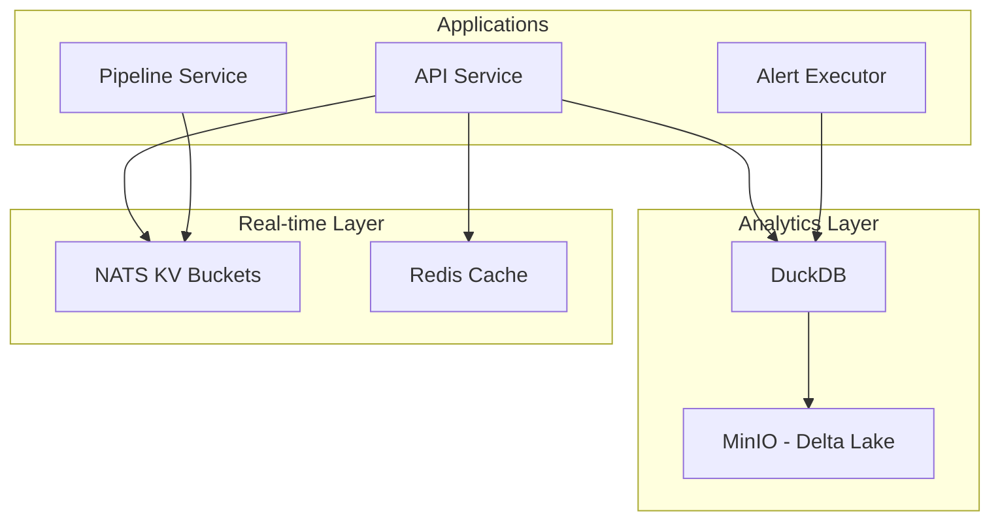

# 🗄️ Ekko CE - Database Schema Reference

## 🎯 **OVERVIEW**

Ekko CE uses a **hybrid storage architecture** combining DuckDB for analytics and NATS KV for real-time state management.

## 🏗️ **STORAGE ARCHITECTURE**



---

## 📊 **DUCKDB SCHEMA**

### **🏠 Core Tables**

#### **1. wallets**
```sql
CREATE TABLE wallets (
    id UUID PRIMARY KEY,
    name VARCHAR NOT NULL,
    address VARCHAR NOT NULL,
    network VARCHAR NOT NULL,
    created_at TIMESTAMP DEFAULT CURRENT_TIMESTAMP,
    updated_at TIMESTAMP DEFAULT CURRENT_TIMESTAMP,
    
    -- Constraints
    UNIQUE(address, network)
);
```

**Indexes:**
```sql
CREATE INDEX idx_wallets_address ON wallets(address);
CREATE INDEX idx_wallets_network ON wallets(network);
CREATE INDEX idx_wallets_created_at ON wallets(created_at);
```

**Sample Data:**
```sql
INSERT INTO wallets VALUES (
    '01234567-89ab-cdef-0123-456789abcdef',
    'My Trading Wallet',
    '0x1234567890abcdef1234567890abcdef12345678',
    'avalanche',
    '2025-06-20 10:00:00',
    '2025-06-20 10:00:00'
);
```

#### **2. nodes**
```sql
CREATE TABLE nodes (
    id UUID PRIMARY KEY,
    name VARCHAR NOT NULL,
    rpc_url VARCHAR NOT NULL,
    network VARCHAR NOT NULL,
    subnet VARCHAR NOT NULL,
    vmtype VARCHAR NOT NULL,
    is_active BOOLEAN DEFAULT true,
    created_at TIMESTAMP DEFAULT CURRENT_TIMESTAMP,
    updated_at TIMESTAMP DEFAULT CURRENT_TIMESTAMP,
    
    -- Constraints
    UNIQUE(network, subnet, vmtype)
);
```

**Indexes:**
```sql
CREATE INDEX idx_nodes_network_subnet ON nodes(network, subnet);
CREATE INDEX idx_nodes_active ON nodes(is_active);
```

**Sample Data:**
```sql
INSERT INTO nodes VALUES (
    '01234567-89ab-cdef-0123-456789abcdef',
    'Avalanche Mainnet',
    'https://api.avax.network/ext/bc/C/rpc',
    'avalanche',
    'mainnet',
    'evm',
    true,
    '2025-06-20 10:00:00',
    '2025-06-20 10:00:00'
);
```

#### **3. alerts**
```sql
CREATE TABLE alerts (
    id UUID PRIMARY KEY,
    name VARCHAR NOT NULL,
    description TEXT,
    natural_language_query TEXT NOT NULL,
    polars_dsl TEXT,
    parameters JSON,
    is_active BOOLEAN DEFAULT true,
    created_at TIMESTAMP DEFAULT CURRENT_TIMESTAMP,
    updated_at TIMESTAMP DEFAULT CURRENT_TIMESTAMP,
    last_triggered_at TIMESTAMP,
    trigger_count INTEGER DEFAULT 0
);
```

**Indexes:**
```sql
CREATE INDEX idx_alerts_active ON alerts(is_active);
CREATE INDEX idx_alerts_created_at ON alerts(created_at);
CREATE INDEX idx_alerts_last_triggered ON alerts(last_triggered_at);
```

**Sample Data:**
```sql
INSERT INTO alerts VALUES (
    '01234567-89ab-cdef-0123-456789abcdef',
    'Low Balance Alert',
    'Alert when wallet balance drops below threshold',
    'Alert me when my wallet balance is below 10 AVAX',
    'wallet_balances.filter(pl.col("balance") < 10.0)',
    '{"wallet_address": "0x1234...", "threshold": 10.0, "token": "AVAX"}',
    true,
    '2025-06-20 10:00:00',
    '2025-06-20 10:00:00',
    null,
    0
);
```

### **📊 Analytics Views**

#### **1. wallet_balances_view**
```sql
CREATE VIEW wallet_balances_view AS
SELECT 
    w.id as wallet_id,
    w.name as wallet_name,
    w.address,
    w.network,
    -- Balance data would come from Delta Lake via DuckDB S3 extension
    -- This is a placeholder structure
    0.0 as balance,
    'AVAX' as token_symbol,
    CURRENT_TIMESTAMP as last_updated
FROM wallets w
WHERE w.is_active = true;
```

#### **2. recent_transactions_view**
```sql
CREATE VIEW recent_transactions_view AS
SELECT 
    -- Transaction data would come from Delta Lake
    -- This is a placeholder structure
    'placeholder' as hash,
    'placeholder' as from_address,
    'placeholder' as to_address,
    0.0 as value,
    'AVAX' as token_symbol,
    'avalanche' as network,
    CURRENT_TIMESTAMP as timestamp
LIMIT 0; -- Placeholder view
```

---

## 🔑 **NATS KV BUCKETS**

### **1. wallets-kv**
**Purpose:** Real-time wallet state and configuration

**Schema:**
```json
{
  "key": "wallet:{wallet_id}",
  "value": {
    "id": "01234567-89ab-cdef-0123-456789abcdef",
    "name": "My Trading Wallet",
    "address": "0x1234567890abcdef1234567890abcdef12345678",
    "network": "avalanche",
    "is_active": true,
    "monitoring_enabled": true,
    "last_balance_check": "2025-06-20T10:00:00Z",
    "metadata": {
      "created_by": "user_id",
      "tags": ["trading", "main"]
    }
  }
}
```

### **2. nodes-kv**
**Purpose:** Node configuration and health status

**Schema:**
```json
{
  "key": "node:{network}:{subnet}:{vmtype}",
  "value": {
    "id": "01234567-89ab-cdef-0123-456789abcdef",
    "name": "Avalanche Mainnet",
    "rpc_url": "https://api.avax.network/ext/bc/C/rpc",
    "network": "avalanche",
    "subnet": "mainnet",
    "vmtype": "evm",
    "is_active": true,
    "health_status": "healthy",
    "last_health_check": "2025-06-20T10:00:00Z",
    "response_time_ms": 150,
    "error_count": 0,
    "metadata": {
      "fetcher_assigned": "fetcher-1",
      "last_block": 12345678
    }
  }
}
```

### **3. alerts-kv**
**Purpose:** Alert configuration and execution state

**Schema:**
```json
{
  "key": "alert:{alert_id}",
  "value": {
    "id": "01234567-89ab-cdef-0123-456789abcdef",
    "name": "Low Balance Alert",
    "is_active": true,
    "polars_dsl": "wallet_balances.filter(...)",
    "parameters": {
      "wallet_address": "0x1234...",
      "threshold": 10.0
    },
    "execution_state": {
      "last_executed": "2025-06-20T10:00:00Z",
      "last_result": false,
      "last_value": "15.5",
      "execution_count": 42,
      "error_count": 0
    },
    "schedule": {
      "type": "interval",
      "interval_seconds": 300
    }
  }
}
```

### **4. settings-kv**
**Purpose:** System and user settings

**Schema:**
```json
{
  "key": "settings:notifications",
  "value": {
    "email": {
      "enabled": true,
      "destinations": [
        {
          "address": "user@example.com",
          "enabled": true
        }
      ]
    },
    "telegram": {
      "enabled": false,
      "destinations": []
    },
    "discord": {
      "enabled": true,
      "destinations": [
        {
          "webhook_url": "https://discord.com/api/webhooks/...",
          "enabled": true
        }
      ]
    }
  }
}
```

---

## 💾 **MINIO DELTA LAKE SCHEMA**

### **Directory Structure:**
```
s3://blockchain-data/
├── avalanche/
│   └── mainnet/
│       ├── transactions/
│       │   ├── year=2025/
│       │   │   └── month=06/
│       │   │       └── day=20/
│       │   │           ├── part-00000.parquet
│       │   │           └── _delta_log/
│       │   └── _delta_log/
│       ├── blocks/
│       └── balances/
└── ethereum/
    └── mainnet/
        ├── transactions/
        └── blocks/
```

### **1. Transactions Table**
```sql
-- Delta Lake schema (conceptual)
CREATE TABLE transactions (
    hash VARCHAR PRIMARY KEY,
    from_address VARCHAR NOT NULL,
    to_address VARCHAR,
    value DECIMAL(38,18),
    token_symbol VARCHAR,
    network VARCHAR NOT NULL,
    subnet VARCHAR NOT NULL,
    block_number BIGINT,
    block_hash VARCHAR,
    transaction_index INTEGER,
    gas_price DECIMAL(38,18),
    gas_limit BIGINT,
    gas_used BIGINT,
    status VARCHAR,
    timestamp TIMESTAMP,
    details JSON,
    metadata JSON
) 
PARTITIONED BY (
    year INTEGER,
    month INTEGER,
    day INTEGER
);
```

### **2. Blocks Table**
```sql
CREATE TABLE blocks (
    block_number BIGINT PRIMARY KEY,
    block_hash VARCHAR NOT NULL,
    parent_hash VARCHAR,
    network VARCHAR NOT NULL,
    subnet VARCHAR NOT NULL,
    timestamp TIMESTAMP,
    transaction_count INTEGER,
    gas_used BIGINT,
    gas_limit BIGINT,
    miner VARCHAR,
    difficulty DECIMAL(38,0),
    size BIGINT,
    metadata JSON
)
PARTITIONED BY (
    year INTEGER,
    month INTEGER
);
```

### **3. Balances Table**
```sql
CREATE TABLE balances (
    address VARCHAR NOT NULL,
    token_symbol VARCHAR NOT NULL,
    balance DECIMAL(38,18),
    network VARCHAR NOT NULL,
    subnet VARCHAR NOT NULL,
    block_number BIGINT,
    timestamp TIMESTAMP,
    metadata JSON,
    
    PRIMARY KEY (address, token_symbol, block_number)
)
PARTITIONED BY (
    network VARCHAR,
    year INTEGER,
    month INTEGER
);
```

---

## 🔄 **DATA FLOW & SYNCHRONIZATION**

### **1. Write Path:**
```
Pipeline → NATS → Transactions Writer → MinIO (Delta Lake)
                ↓
              NATS KV (Real-time state)
```

### **2. Read Path:**
```
API ← DuckDB ← MinIO (Delta Lake)
API ← NATS KV (Real-time state)
```

### **3. Synchronization:**
- **DuckDB** periodically syncs with Delta Lake tables
- **NATS KV** maintains real-time state
- **Redis** caches frequently accessed data

---

## 🔧 **MAINTENANCE OPERATIONS**

### **1. Database Backup**
```sql
-- Export DuckDB data
COPY wallets TO 'backup/wallets.parquet';
COPY nodes TO 'backup/nodes.parquet';
COPY alerts TO 'backup/alerts.parquet';
```

### **2. Data Cleanup**
```sql
-- Clean old alert execution logs (older than 30 days)
DELETE FROM alert_executions 
WHERE created_at < CURRENT_TIMESTAMP - INTERVAL '30 days';

-- Archive old transactions (move to cold storage)
-- This would be handled by Delta Lake retention policies
```

### **3. Performance Optimization**
```sql
-- Analyze table statistics
ANALYZE wallets;
ANALYZE nodes;
ANALYZE alerts;

-- Rebuild indexes if needed
DROP INDEX idx_wallets_address;
CREATE INDEX idx_wallets_address ON wallets(address);
```

---

## 📊 **MONITORING QUERIES**

### **1. System Health**
```sql
-- Active wallets count
SELECT COUNT(*) as active_wallets FROM wallets WHERE is_active = true;

-- Active nodes by network
SELECT network, COUNT(*) as node_count 
FROM nodes 
WHERE is_active = true 
GROUP BY network;

-- Alert statistics
SELECT 
    COUNT(*) as total_alerts,
    SUM(CASE WHEN is_active THEN 1 ELSE 0 END) as active_alerts,
    AVG(trigger_count) as avg_triggers
FROM alerts;
```

### **2. Performance Metrics**
```sql
-- Recent transaction volume
SELECT 
    DATE_TRUNC('hour', timestamp) as hour,
    COUNT(*) as transaction_count
FROM recent_transactions_view
WHERE timestamp > CURRENT_TIMESTAMP - INTERVAL '24 hours'
GROUP BY hour
ORDER BY hour;
```

This schema reference provides comprehensive documentation for all data storage patterns in the Ekko CE platform. 🗄️
