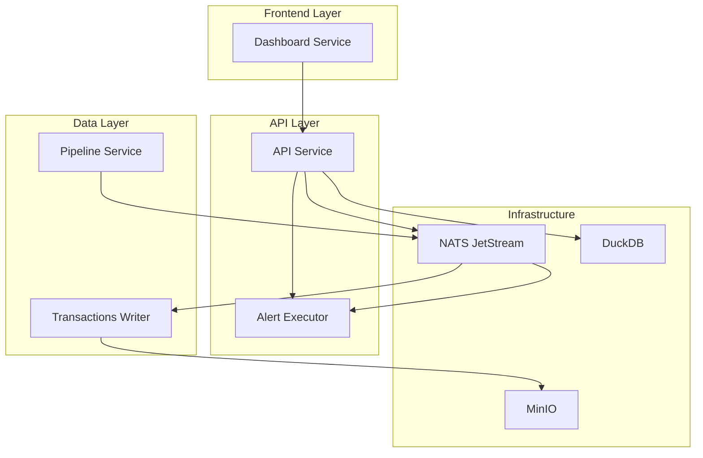

# 📋 Ekko CE - Service Specifications

## 🎯 **OVERVIEW**

This document provides comprehensive specifications for all services in the Ekko CE (Community Edition) blockchain monitoring and alerting platform.

## 🏗️ **SYSTEM ARCHITECTURE**



## 📊 **DATA FLOW**

1. **Pipeline Service** → Fetches blockchain data → Publishes to NATS
2. **Transactions Writer** → Consumes NATS → Stores in MinIO (Delta Lake)
3. **API Service** → Reads from DuckDB → Serves REST endpoints
4. **Alert Executor** → Processes alerts → Executes Polars queries
5. **Dashboard** → Consumes API → Displays UI

---

# 🔧 **SERVICE SPECIFICATIONS**

## 1. 🌐 **API SERVICE**

### **📍 Location:** `api/`
### **🐳 Container:** `ekko-ce-api-1`
### **🔌 Port:** `8000`
### **🗄️ Database:** DuckDB + NATS JetStream KV

### **🎯 Purpose:**
Central REST API service providing data access, user management, and alert configuration.

### **📡 REST Endpoints:**

#### **🏠 System Endpoints**
```http
GET  /                          # Health check
GET  /database/status          # Database status
```

#### **👤 Authentication**
```http
POST /token                    # Login (get JWT token)
POST /users                    # Create user
GET  /users/me                 # Get current user
```

#### **💰 Wallets**
```http
GET    /wallets                # List all wallets
POST   /wallets                # Create wallet
GET    /wallets/{id}           # Get wallet by ID
PUT    /wallets/{id}           # Update wallet
DELETE /wallets/{id}           # Delete wallet
```

#### **🖥️ Nodes**
```http
GET    /nodes                  # List all nodes
POST   /nodes                  # Create node
GET    /nodes/{id}             # Get node by ID
PUT    /nodes/{id}             # Update node
DELETE /nodes/{id}             # Delete node
```

#### **🚨 Alerts**
```http
GET    /alerts                 # List all alerts
POST   /alerts                 # Create alert
GET    /alerts/{id}            # Get alert by ID
PUT    /alerts/{id}            # Update alert
DELETE /alerts/{id}            # Delete alert
POST   /alerts/infer           # DSPy alert inference
POST   /alerts/preview-dsl     # Generate DSL preview
```

#### **⚡ Alert Execution**
```http
GET    /alerts/executor/stats  # Executor statistics
POST   /alerts/test-execution  # Test alert execution
POST   /alerts/execute-dsl     # Execute custom DSL
```

#### **💳 Transactions**
```http
GET    /api/transactions       # List transactions
GET    /api/transactions/{hash} # Get transaction by hash
```

#### **⚙️ Settings**
```http
GET    /api/settings/notifications # Get notification settings
PUT    /api/settings/notifications # Update notification settings
```

### **📨 NATS Subjects (Published):**
```
wallet.created          # Wallet creation events
wallet.updated          # Wallet update events
wallet.deleted          # Wallet deletion events
node.created            # Node creation events
node.updated            # Node update events
alert.created           # Alert creation events
alert.execute           # Alert execution requests
system.startup          # System startup events
```

### **📥 NATS Subjects (Consumed):**
```
tx.*                    # Transaction events (background processor)
alert.result            # Alert execution results
alert.error             # Alert execution errors
```

### **🔧 Environment Variables:**
```bash
NATS_URL=nats://nats:4222
DATABASE_URL=duckdb:///app/data/ekko.db
JWT_SECRET_KEY=your-secret-key
OPENAI_API_KEY=your-openai-key
AKASH_API_KEY=your-akash-key
```

### **📦 Dependencies:**
- FastAPI, Uvicorn
- NATS-py, DuckDB
- DSPy, OpenAI
- Polars, Pandas
- JWT, Passlib

---

## 2. ⚡ **ALERT EXECUTOR SERVICE**

### **📍 Location:** `api/app/alert_executor.py`
### **🔄 Type:** FastAPI Background Task
### **🎯 Purpose:**
Executes alert queries using Polars DSL against mock/real data sources.

### **🔧 Core Components:**

#### **📊 Data Sources (Mock):**
- `wallet_balances` - Wallet balance data
- `transactions` - Transaction history
- `price_feeds` - Token price data
- `defi_yields` - DeFi protocol yields

#### **🎛️ Execution Engine:**
```python
class PolarsExecutor:
    def execute_alert(request: AlertExecutionRequest) -> AlertExecutionResult
    def load_data_sources(sources: List[str]) -> Dict[str, DataFrame]
    def validate_dsl(dsl: str) -> bool
    def execute_dsl(dsl: str, data: Dict) -> DataFrame
```

### **📨 NATS Subjects (Consumed):**
```
alert.execute           # Alert execution requests
```

### **📥 NATS Subjects (Published):**
```
alert.result            # Successful execution results
alert.error             # Execution errors
```

### **📋 Message Schemas:**

#### **Request:**
```json
{
  "execution_id": "uuid",
  "alert_id": "string",
  "polars_dsl": "string",
  "data_sources": ["wallet_balances"],
  "output_mapping": {
    "result_column": "below_threshold",
    "value_column": "current_value"
  },
  "parameters_used": {},
  "timeout_seconds": 30
}
```

#### **Result:**
```json
{
  "execution_id": "uuid",
  "alert_id": "string",
  "result": true,
  "value": "15.5",
  "metadata": {
    "execution_time_ms": 42,
    "rows_processed": 1,
    "worker_id": "worker-abc123"
  },
  "completed_at": "2025-06-20T15:57:44Z"
}
```

### **⚙️ Configuration:**
```python
max_concurrent_executions = 10
execution_timeout_seconds = 30
worker_id = f"worker-{uuid4()[:8]}"
```

---

## 3. 🔄 **PIPELINE SERVICE**

### **📍 Location:** `pipeline/`
### **🐳 Container:** `ekko-ce-pipeline-1`
### **🎯 Purpose:**
Fetches blockchain data from RPC nodes and publishes to NATS for processing.

### **🔧 Core Components:**

#### **🌐 Node Management:**
- Fetches node configurations from API
- Creates fetchers per network-subnet-vmtype group
- Monitors node health and performance

#### **📊 Data Fetching:**
- Block data retrieval
- Transaction processing
- Event log parsing
- Balance monitoring

### **📨 NATS Subjects (Published):**
```
tx.{network}.{subnet}           # Transaction events
block.{network}.{subnet}        # Block events
balance.{network}.{subnet}      # Balance updates
event.{network}.{subnet}        # Contract events
```

### **🔧 Environment Variables:**
```bash
NATS_URL=nats://nats:4222
API_URL=http://api:8000
FETCH_INTERVAL_SECONDS=10
MAX_CONCURRENT_FETCHERS=5
```

---

## 4. 💾 **TRANSACTIONS WRITER SERVICE**

### **📍 Location:** `transactions-writer/` (To be created)
### **🎯 Purpose:**
Consumes transaction data from NATS and stores in MinIO as Delta Lake tables.

### **🔧 Core Components:**

#### **📥 NATS Consumer:**
- Subscribes to transaction subjects
- Processes messages in batches
- Handles backpressure and retries

#### **💽 Delta Lake Writer:**
- Creates Delta tables in MinIO
- Partitions by network/subnet
- Maintains table versioning

### **📥 NATS Subjects (Consumed):**
```
tx.*                    # All transaction events
```

### **💾 Storage Structure:**
```
s3://bucket/
├── avalanche/
│   └── mainnet/
│       ├── transactions/
│       ├── blocks/
│       └── balances/
└── ethereum/
    └── mainnet/
        ├── transactions/
        └── blocks/
```

---

## 5. 🎨 **DASHBOARD SERVICE**

### **📍 Location:** `dashboard/`
### **🐳 Container:** `ekko-ce-dashboard-1`
### **🔌 Port:** `3000`
### **🎯 Purpose:**
React-based frontend for monitoring wallets, alerts, and system status.

### **🖼️ Pages:**

#### **🏠 Dashboard**
- System overview
- Recent transactions
- Alert status
- Wallet summaries

#### **💰 Wallets**
- Wallet list/grid view
- Add/edit/delete wallets
- Balance monitoring
- Transaction history

#### **🚨 Alerts**
- Alert configuration
- Natural language input
- DSL preview
- Execution history

#### **🖥️ Nodes**
- Node management
- Health monitoring
- Performance metrics

#### **⚙️ Settings**
- Notification configuration
- User preferences
- System settings

### **🔧 Environment Variables:**
```bash
REACT_APP_API_URL=http://localhost:8000
REACT_APP_WS_URL=ws://localhost:8000/ws
```

### **📦 Dependencies:**
- React, TypeScript
- Material-UI / Tailwind CSS
- React Query
- React Router

---

## 6. 🗄️ **INFRASTRUCTURE SERVICES**

### **📡 NATS JetStream**
- **Container:** `nats`
- **Port:** `4222`
- **Purpose:** Message broker and KV store
- **Streams:** `transactions`, `alerts`, `events`
- **KV Buckets:** `wallets`, `nodes`, `alerts`, `settings`

### **💾 MinIO**
- **Container:** `minio`
- **Ports:** `9000` (API), `9001` (Console)
- **Purpose:** S3-compatible object storage
- **Buckets:** `blockchain-data`, `blockchain-events`

### **🗃️ DuckDB**
- **Location:** Embedded in API service
- **Purpose:** Analytics database
- **Features:** Delta Lake plugin, S3 access

---

## 🔄 **INTER-SERVICE COMMUNICATION**

### **📨 Message Flow:**
1. **Pipeline** → NATS → **Transactions Writer** → MinIO
2. **API** → NATS → **Alert Executor** → NATS → **API**
3. **Dashboard** → HTTP → **API** → DuckDB/NATS

### **🔐 Authentication:**
- JWT tokens for API access
- Service-to-service via internal network
- NATS authentication (optional)

### **📊 Monitoring:**
- Health check endpoints
- Prometheus metrics (planned)
- Structured logging
- Error tracking

---

## 🚀 **DEPLOYMENT**

### **🐳 Docker Compose Services:**
```yaml
services:
  api:           # Main API service
  dashboard:     # React frontend
  pipeline:      # Data fetching
  nats:         # Message broker
  minio:        # Object storage
```

### **🔧 Development Setup:**
```bash
# Start all services
docker-compose up -d

# View logs
docker-compose logs -f api

# Rebuild service
docker-compose build api
```

This specification serves as the definitive guide for understanding, developing, and maintaining the Ekko CE platform. 📚

---

## 📚 **RELATED DOCUMENTATION**

- **[API Reference](./API_REFERENCE.md)** - Complete REST API documentation
- **[NATS Subjects Reference](./NATS_SUBJECTS_REFERENCE.md)** - Message schemas and communication patterns
- **[Developer Onboarding](./DEVELOPER_ONBOARDING.md)** - Quick start guide for new developers
- **[Database Schema](./DATABASE_SCHEMA.md)** - DuckDB table structures and relationships
- **[Deployment Guide](./DEPLOYMENT.md)** - Production deployment instructions
